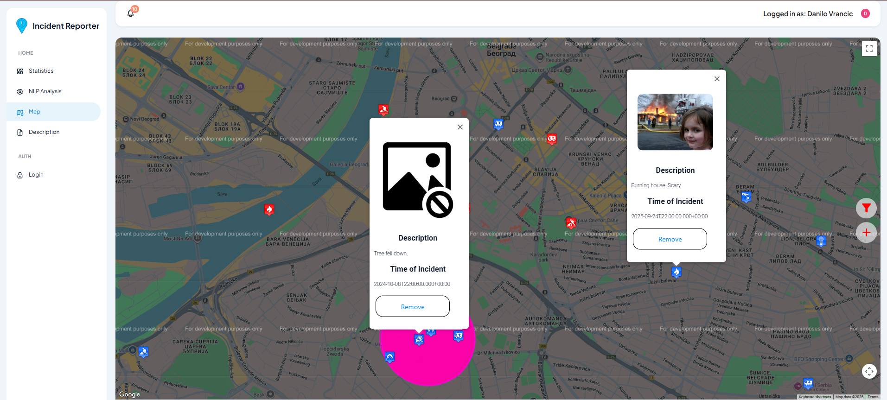

# Incident Reporter System

A full-stack web application for **anonymous incident reporting** and **moderation**.  
Built with **Spring Boot (Java)**, **Angular**, and **MySQL**, this project demonstrates microservice architecture, authentication, NLP, and geolocation features — all while keeping things smooth for both users and moderators.

---

## ✨ Features

### User Side

- Report incidents **anonymously**:
  - Pick a location on the map.
  - Choose an **incident type** and a **subtype**.
  - Add an optional description and relevant image.
- Browse approved incidents on a map with filters:
  - By type/subtype.
  - By date (last 24h, 7 days, 31 days, or all time).
  - By location.
  - By range from selection marker.

### Moderator Side

- Review **pending incidents** before they go public.
- Approve or permanently reject reports.
- Option to manage incidents with or without a map interface.

- User authentication via:
  - Local database login, or
  - University domain accounts (`*.etf.unibl.org`) with **OAuth2**.
- Microservices for:
  - Reporting & visualization of incident stats.
  - Detecting clusters of frequent incidents.
  - NLP service to group similar text reports.

---

## Tech Stack

- **Backend:** Spring Boot (Java 17), Spring Security, Spring Data JPA  
- **Frontend:** Angular (Material Design, Google Maps API)  
- **Database:** MySQL  
- **Other tools:** OAuth2, NLP (Stanford CoreNLP), REST API  

---

## Getting Started

### Prerequisites

- [Node.js](https://nodejs.org/) (v18+) and npm
- [Angular CLI](https://angular.io/cli)
- [Java JDK 17+](https://www.oracle.com/java/technologies/javase/jdk17-archive-downloads.html)
- [Maven](https://maven.apache.org/)
- [MySQL Server](https://dev.mysql.com/downloads/)

---

# Installation:

### Database Installation

You have two options to set up the database:

### Option 1: Using the `.mwb` MySQL Workbench model

1. Open the `incident_reporter.mwb` file in MySQL Workbench.
2. Use **Forward Engineer**:
   - Go to `Database → Forward Engineer`.
   - Follow the wizard to generate and execute the schema in your MySQL server.
3. Verify that all tables and relationships have been created successfully.

### Option 2: Using the provided `dll.sql` file

1. Open MySQL Workbench or any MySQL client.
2. Run the SQL script:

   ```sql
   SOURCE ./database/dll.sql;
   ```

3. Confirm that the database incident_reporter and all tables are created.

    Make sure the credentials match those in application.properties (backend configuration).

---

## Backend Setup (Spring Boot REST API)

This section guides you through installing Java, Maven, configuring the backend, and running the Spring Boot REST API.

---

### Step 1: Install Java (JDK 17+)

1. Download and install **Java 17** or higher from [Oracle](https://www.oracle.com/java/technologies/javase/jdk17-archive-downloads.html).
2. Verify the installation in your terminal or command prompt:

```bash
java -version
javac -version
```

_You should see the installed Java version listed._

---

### Step 2: Install Maven

1. Install Maven: [Apache Maven](https://maven.apache.org/)
2. Verify:

```bash
mvn -version
```

---

### Step 3: Configure Spring Boot

- Open `incident-reporter-backend-app/src/main/resources/application.properties.`
- Set your MySQL credentials:

```properties
spring.datasource.url=jdbc:mysql://localhost:3306/incident_reporter
spring.datasource.username={your_database_username}
spring.datasource.password={your_database_password}
spring.jpa.hibernate.ddl-auto=update
```

---

### Step 4: Build and Run the Backend

Option 1: Using Maven

```bash
cd incident-reporter-backend-app
mvn clean install
mvn spring-boot:run
```

Option 2: Using the Packaged JAR

```bash
cd incident-reporter-backend-app/target
java -jar incident-reporter-backend-app-0.0.1-SNAPSHOT.jar
```

_The REST API will start (by default) at: <http://localhost:8443>_

## Frontend Setup (Angular)

This section explains how to install dependencies, run the Angular frontend, and connect it to the backend.

---

### Step 1: Install Node.js and Angular CLI

1. Download and install [Node.js](https://nodejs.org/) (v18+ recommended).
2. Verify Node.js and npm:

```bash
node -v
npm -v
```

3. Install Angular CLI globally:

```bash
npm install -g @angular/cli
```

### Step 2: Install Project Dependencies

1. Navigate to the frontend project directory:

```bash
cd incident-reporter-frontend-app
```

2. Install all dependencies:

```bash
npm install
```

### Step 3: Configure Backend API Endpoint

Ensure the backend REST API is running at http://localhost:8443
.

Update environment file if needed (src/environments/environment.ts):

```typescript
export const environment = {
    apiPort: '8443',
    apiBaseUrl: 'http://localhost:8443',
    incidentUrl: 'http://localhost:8443' + '/incident',
    incidentSubtypeUrl: 'http://localhost:8443' + '/incident_subtype',
    incidentTypeUrl: 'http://localhost:8443' + '/incident_type',
    analysisUrl: 'http://localhost:8443' + '/analysis',
    statisticsUrl: 'http://localhost:8443' + '/statistics',
    nlpUrl: 'http://localhost:8443' + '/nlp'
}
```

### Step 4: Run the Frontend

```bash
ng serve
```

---

## Detailed Overview

This project is more than just CRUD + Maps. It combines **data visualization, NLP, geolocation, and security** to make incident reporting useful for both everyday users and system administrators. Here are some highlights:

### Natural Language Processing (NLP)
I've integrated **Stanford CoreNLP (`edu.stanford.nlp`)** to analyze the _sentiment of user-submitted comments_ on incidents.  
The model classifies each string into one of five categories:

- Very Negative  
- Negative  
- Neutral  
- Positive  
- Very Positive  

This allows moderators to quickly get a “tone check” on reports and detect patterns in user submissions. For example, an increase in very negative reports in a specific area could indicate growing dissatisfaction or potential safety issues.

### Statistics & Analytics
The **Statistics Page** provides a deep dive into the reported data. Realized by **Angular Material** + **ApexCharts**, it includes:

- **Incidents in Parts of Day**  
  - Visualizes how incidents distribute across morning, afternoon, evening, and night.

- **Incidents Types Distribution**  
  - Pie chart showing proportions of high-level categories (e.g., Theft, Accident, Vandalism).

- **Incidents Subtypes Distribution**  
  - Granular breakdown of subcategories under each incident type.

- **Incidents in Previous Days / Per Year**  
  - Tracks historical trends to reveal spikes, unusual activity, or seasonal patterns.

- **Incidents in Days of the Week**  
  - Week-based heatmaps to discover if weekends or weekdays are riskier.

This analytics module provides actionable insights, allowing moderators and admins to **make data-driven decisions** instead of relying only on raw incident lists.

### Geolocation & Clustering
- Incidents are shown on an **interactive map** (Google Maps API).  
- **Marker clustering** groups together reports within close proximity.  
- Magenta cluster circles highlight **frequent hotspots** — making it easy to spot recurring issues without digging through endless lists.

### 🔒 Security & Authentication
- Users can **report incidents anonymously**, ensuring privacy and participation.  
- Moderators and admins log in securely via:  
  - **Local Database Login**, or  
  - **OAuth2 with University Accounts** (`*.etf.unibl.org`).  
- Role-based access ensures that anonymous users, moderators, and admins only see what they’re supposed to.

---

---

### Screenshots & GIFs

Below are some screenshots showcasing key features of the application:

#### 1️⃣ Admin Map View


_A map interface for administrators to monitor incidents. What can also be seen are the clusters that form groups of incidents that happen often in a close enough radius (indicated by the magenta circles)._

#### 2️⃣ Incident Detail View


_Shows detailed information about a specific incident selected on the map. Also the option to remove the incident is available._

#### 3️⃣ Incident Reporting by an anonymous user


_Shows the procedure that the users go through to report an incident._

#### 4️⃣ Incident Approval Procedure by a Moderator

 
 _Displays the results of Natural Language Processing (NLP) analysis for reported incidents._

#### 5️⃣ Statistics Page Preview

 
 _Showing the Statistics page with its features._

 #### 6️⃣ NLP Page Preview

 
 _Showing the NLP page with its features._

 ---

#### About This Project

This project is one of my deep dives into **full-stack engineering**, blending backend (Spring Boot), frontend (Angular), and data science (NLP).

I like working at the intersection of **backend performance, frontend design, and smart services (AI, cloud, analytics)**.

🔗 Check out my other projects on GitHub:

- [My Secure Internet Forum](https://github.com/DaniloVrancic/my-internet-forum) – A Full Stack Application where the focus was on security and implementing the best security practices using Spring Security.  
- [S3 Flutter Client](https://github.com/DaniloVrancic/s3-client) – A cross-platform Flutter client for S3-compatible object storage services.
- [Basic Asset Registry](https://github.com/DaniloVrancic/basic-resources-registry-mobile-app) – A simple asset registry app built with React Native, focusing on clean UI and fundamental asset management features like creating, editing, and organizing records. 
- [Gym Management System](https://github.com/DaniloVrancic/IP_Gym_Project_2024) – Full-stack project for managing gym with 3 different front-end apps written in different frameworks.

_If you’ve read this far into the README — thanks! You’re either genuinely interested in incident reporting systems, or just love good documentation. Either way, hope you've enjoyed my presentation!_

---